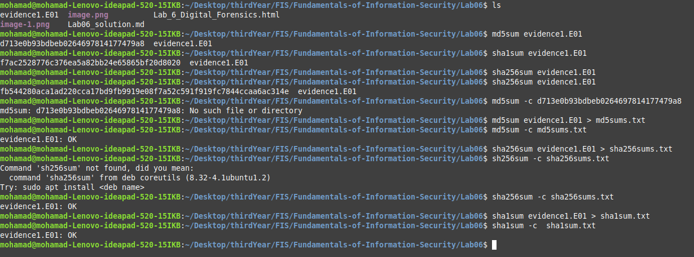
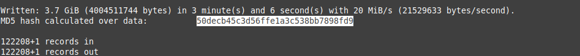
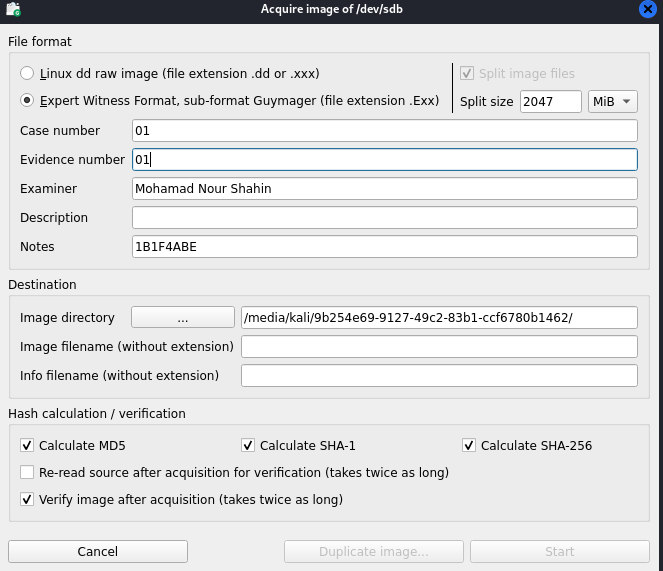
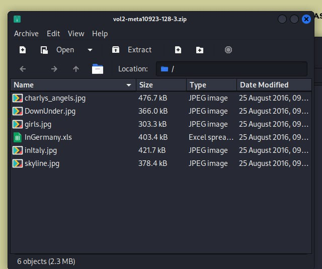

# Lab 06 OS security

### Name: Mohamad Nour Shahin (mo.shahin@innopolis.university)
### Name: Anas atasi (m.alatasi@innopolis.university)
### Name: Hayder Sarhan (h.sarhan@innopolis.university)


### Group number: B22-CBS-01


# Questions to answer

>

## Instructions
- You may work in teams of up to 3 students.
- Collaborate to produce one unified report.
- Each team member must submit a copy of the report on Moodle.

>

## Setting up your environment


### You need to prepare 2 USB drives

- The first one should have a [CAINE live environment](https://www.caine-live.net/) that will be used to collect evidence.

    >
    You can also use a VM or any other live forensic OS (for example boot Kali Linux in forensics mode).
    >

---

### Solution:

Firstly, I want through [Kali.org](https://www.kali.org/get-kali/#kali-live) to install the Live boot version where i used it in the Virtualbox. 

here is the Kali Linux in forensics mode:


- On the second one (this drive will be called drive A) you should deploy [this](https://mega.nz/file/CdtQjKgC%2390sNQGrcrlJxcFKa-Cs-ZoitWuMwQ8k4MEaZd6qZLKU) disk image.

    >

    Note: The disk image is compressed with special utility that preserves original bits intact. You should uncompress it (using FTK imager) and burn it on the flash drive (do not forget about unallocated space).

    >

---

### Solution:


1. Download the image, calculate the hash value for it, and validate it:

    

2. prepare the USB Device and wipe the data from it (Zeroed) using command:

    ```command
    sudo fdisk -l #for checking the flash informaiton
    sudo dc3dd wipe=/dev/sdc1 # for wipe the data from flash drive
    sudo ewfexport evidence1.E01 -f raw -t - | sudo dcfldd of=/dev/sdc1 # for uncompress the image inside the flash drive
    ```

    

    The flash drive is on ```/dev/sdc``` partition

    

    


---

## Imaging

1. Discuss how you can retrieve an image from a currently off-line, USB stick in a forensically sound manner. Create and describe this method

---

### Solution:

To retrieve an image from an offline USB stick in a forensically sound manner, follow these steps:


1. Prepare a secure forensic environment, using a dedicated workstation equipped with write-blockers and forensic tools.
2. Connect the USB stick in read-only mode to prevent any changes.

3. Use forensic tools to check the integrity of the USB stick without altering its data.

4. Create a forensic image of the USB stick using specialized imaging software.

5. Choose an appropriate forensic image format, such as E01.
6. Save the forensic image onto a write-protected external drive.
7. Analyze the forensic image with forensic software.
8. Locate and extract the desired image file from the forensic image.
9. Verify the extracted image's integrity by comparing its hash value to the original hash value.

---

2. Write a one-line description, or note a useful feature for the following tools included in CAINE: Guymager, Disk Image Mounter, dcfldd / dc3dd, kpartx.

---

### Solution:

**Guymager:** A forensic imaging tool used to capture and verify disk images from different storage devices.

**Disk Image Mounter:** A utility that mounts disk images as read-only file systems for safe access.

**dcfldd / dc3dd:** Command-line utilities for creating and verifying disk images, offering features like hashing and data wiping.

**kpartx:** A Linux tool that creates device mappings for partitions found within disk images.


---


3. Follow your method to retrieve the image from drive A. Please use timestamps, explain every tool and note down the version.

---

### Solution:


I used Guymager tool to do this task from Kali linux (forensics) I run this command:

  ```command
  sudo fdisk -l # to check the connected flash devices
  sudo guymager
  ```

  


Now, we can see our connected devices below:

  

we will choose our device  Generic Flash_Disk ```/dev/sdb``` and aquire the image with this configurations and start it:

  


we can check our timestamp and all important details for aquireing the image:

  

after finished it:

  

finally, an evidence about successfuly aquireing the image:

  

---

4. Read about CAINE Linux and its features while waiting on the dump to finish

  - a. Why would you use a Forensic distribution and what are the main differences between a regular distribution?
  - b. When would you use a live environment and when would you use an installed environment?
  - c. What are the policies of CAINE?

---

### Solution:


- a. A forensic distribution like CAINE is tailored for digital forensics and incident response investigations. The key distinction between a forensic distribution and a standard one is that a forensic distribution comes with pre-installed and configured tools specifically for tasks such as disk imaging, data recovery, and analysis. Additionally, forensic distributions are designed to maintain the integrity of evidence and prevent any unintentional changes to the target system.

- b. A live environment is generally utilized for digital forensics on a system that cannot be powered down or when it is crucial to maintain the current state of the system. Conversely, an installed environment is suitable for conducting digital forensics on a system that can be shut down or when a more comprehensive analysis is necessary.

- c. CAINE's policies emphasize open source principles, transparency, and collaboration. Based on Ubuntu, all software included is open source, and the distribution promotes clear documentation for all tools. CAINE also values collaboration by encouraging users to participate in the project through bug reporting, feature suggestions, and sharing knowledge within the community. Furthermore, CAINE aims to offer a user-friendly and customizable interface to enhance the efficiency and effectiveness of the digital forensics process.

---

5. As soon as your dump finishes, start a tool to create a timeline on the image. You will need this timeline later in the assignment.
>

Hint: log2timeline.py

>


---


### Solution:


To use ```log2timeline.py``` we need to isntall it firstly, using commands:
```command
sudo apt-get update
sudo apt install python3-plaso

```

  

to use it we will run this command to gererate the lgo files:

```command
log2timeline --logfile timeline.log --storage-file timeline.plaso /media/kali/9b254e69-9127-49c2-83b1-ccf6780b1462/evidence.E01

```

  


## Integrity Verification

6. Explain the steps of verification of the retrieved evidence from a suspect device.

---


### Solution:


The verification of evidence retrieved from a suspect device is an essential process to maintain its integrity for legal use. The key steps are:

- **Documentation:** Record all relevant information about the suspect device, including make, model, serial number, location of discovery, and the date and time of seizure.

- **Chain of Custody:** Establish and maintain a clear chain of custody, documenting everyone who handles the evidence from its seizure until it is presented in court, with each person signing the custody log.

- **Imaging:** Create a forensic image of the device’s storage media (e.g., hard drive), ensuring it is an exact bit-for-bit copy, so the original evidence remains untouched.

- **Hashing:** Compute cryptographic hash values (like MD5 or SHA-256) for both the original evidence and the forensic image. Matching hash values confirm the data’s integrity.

- **Documentation (Revisited):** Record the hash values in the evidence log, ensuring all records are timestamped.

- **Verification:**  Compare the forensic image with the original device to check for data consistency. Note any discrepancies.

- **Sealing and Storage:** Secure both the original device and forensic image in tamper-proof packaging to prevent unauthorized access.

- **Logs and Reports:** Maintain detailed logs of every action taken and prepare a forensic report that includes the hash value verification results.


---


7. Suppose you are going to exchange your evidence (Drive A) with another student. How you will check the integrity? Write down the steps.


---


### Solution:

To ensure the integrity of evidence when exchanging Drive A with another student, follow these steps:

**Document Everything:** Record all relevant details about Drive A, including its make, model, serial number, and its condition before the exchange.

**Chain of Custody:** Establish a chain of custody log. Both you and the other student should sign and date it to track the exchange.

**Imaging:** Create a forensic image of Drive A, ensuring it’s an exact copy of the original data.

**Hash Verification:** Calculate cryptographic hash values for both the original Drive A and its forensic image. Ensure the hash values match to confirm data integrity.

**Exchange:** Exchange the forensic image with the other student and document the transaction, with both parties acknowledging the exchange in writing.

**Receive and Verify:** Once you receive the exchanged evidence, verify its integrity by calculating hash values again. Compare them with the previously recorded hashes to ensure consistency.

**Update Documentation:** Add the new hash values to your documentation and record the details of the exchange.

**Secure Storage:** Store both the original Drive A and the forensic image received from the other student in tamper-proof packaging for safekeeping.


---


8. Write a small paragraph of max 200 words. Write as if you were verifying the evidence gathering procedure for a court case.


---


### Solution:


In this forensic investigation, we followed a strict procedures to maintain the integrity of the evidence. We used Kali Linux Live in forensics mode to avoid altering the system under examination. First, we wiped a flash drive using dc3dd to ensure no prior data could interfere with our investigation. We then used ewf to create a forensically sound image of the evidence, which we stored on the flash drive. For the image acquisition, we utilized Guymager, a trusted tool in digital forensics. After acquiring the image, we generated both MD5 and SHA-256 hash values to verify the integrity of the original data. These hash values were checked to confirm that the image had not been modified saving their integrity. By following these steps, including secure imaging techniques and proper hashing, we ensured that the evidence remained intact and unaltered, making it suitable for use in court.


---


## Technical analysis


9. Mount your image (image of drive A) and make sure that it is mounted as read-only


---


### Solution:


To mount the image as read only we will use the following command:
```sudo mount --bind -o ro /media/kali/KaliDisk/mountDir /mnt```

  


- where ```ro``` is the flag to mount it as read only


---


10. Identify and write a small paragraph of max 200 words about what kind of image it is. Don’t go into file specific details just yet. This includes but is not limited to

>
- a. What is the size of the image?
- b. What partition type(s) does this image have?
- c. Does it have an MBR/GPT?
- d. etc


>


---


### Solution:


The forensic image under analysis is approximately 400 MB in size, representing a relatively small storage volume. It contains one NTFS partition, which indicates that the original disk was formatted to support a Windows operating system, typically used for system files and applications. Additionally, the image reveals two unallocated partitions, suggesting that these areas of the disk are not currently formatted or used, possibly indicating space that was reserved for future use or remnants from previous partitions. Notably, the image did not contain a Master Boot Record (MBR) or a GUID Partition Table (GPT), which are standard structures used to manage partitions on a disk. The absence of these partitioning schemes may imply that the image was captured from a device that was either not set up with traditional partitioning methods or had been altered in a way that removed these structures. Overall, this compact image presents a unique scenario for analysis, focusing on the single NTFS partition and the implications of the unallocated space.


---


11. Using the information from the timeline you create above, write a small paragraph on what you think happened on this specific USB device. The device owner is suspected in a crime. Try to find the evidence that can support this accusation. Please remain objective, as you would be preparing evidence for a court case. Make it a maximum of 300 words, and use timestamps


---


### Solution:


Based on the forensic investigation conducted using Autopsy, the timeline we generated helped us track changes made on the image. A key finding was a message that hinted at a mystery involving a popular movie, which could indicate efforts to conceal or mislead investigators. We also uncovered images related to some countries, potentially suggesting international ties or activities. Additionally, several files were found with names resembling well-known movies, which may either serve as decoys or hold more critical evidence.


The investigation also revealed a set of suspiciously large files on the device, which stand out due to their size and require further examination. These files were likely created or modified close to the last activity on the device, suggesting they may contain hidden or encrypted data relevant to the investigation. The NTFS partition showed signs of significant file manipulation, including creation, modification, and deletion of files, indicating active use of the machine during a critical timeframe.

In addition to that, we discovered an email on the machine, which could provide crucial information as we continue our analysis.

and the email that was used through communcation : ```thomer1971@outlook.com```

### investigation through deleted images:

  


### investigation through secret data my hidden:

  


### download images as zip file and extracted it and discover it:


  


### investigation through E-mail :

  


---


12. What would help to investigate this evidence further?


---


### Solution:


To further investigate the evidence, several steps are recommended. First, the email should be thoroughly examined for suspicious activity, attachments, or links to the suspicious files found. Additionally, the large files need deeper analysis, such as file carving or decryption, to uncover any hidden or encrypted data. The images pointing to various countries should be analyzed for metadata like geolocation or timestamps, which could reveal more about the device owner's activities. Lastly, reviewing file and network activity logs could help trace any transfers or external communications related to the files. 


---